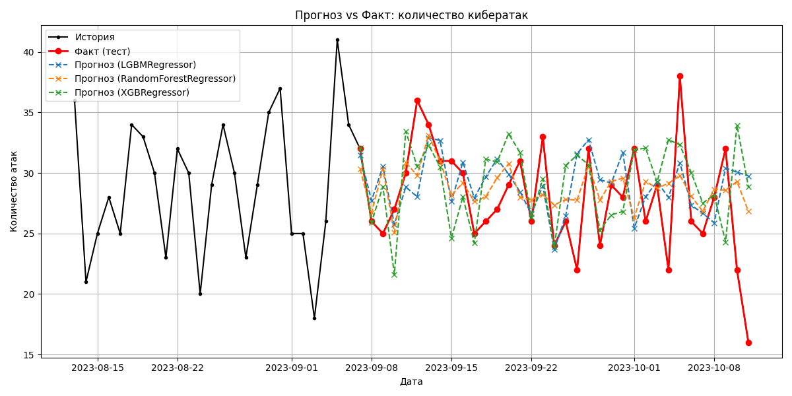

# ML-leason
Обучает и оценивает модели машинного обучения для прогнозирования количества кибератак во времени.

    Параметры:
    ----------
    horizon : int, по умолчанию 35
        Горизонт прогнозирования в единицах времени (например, дней).
        Последние `horizon` наблюдений выделяются в тестовую выборку.

    freq : str, по умолчанию 'D'
        Частота временного ряда (например, 'D' — ежедневно, 'H' — почасово).
        Должна соответствовать частоте агрегации в данных.

    lags : list of int, по умолчанию [1, 2, 3, 7, 14, 30]
        Список лагов (сдвигов во времени), используемых как признаки.
        Например, лаг 7 означает использование значения ряда 7 дней назад.

    dayplot : int, по умолчанию 60
        Количество последних дней, отображаемых на графике для наглядности.

    Модели:
    -------
    - LightGBM (LGBMRegressor)
    - Random Forest (RandomForestRegressor)
    - XGBoost (XGBRegressor, если установлен)

    Возвращает:
    -----------
    None. Выводит метрики качества и график прогноза vs факта.

